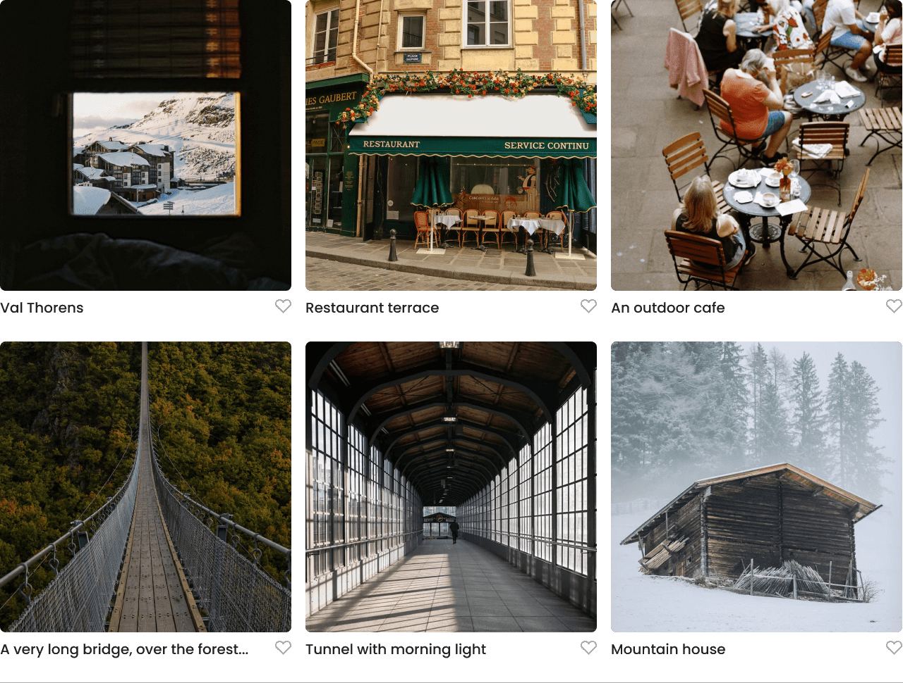

# Project 3: Spots

### Overview

- Intro
- Project Description
- Technologies Used
- Future Improvements
- Live Demo
- Figma
- Image
- Project Video

**Intro**

This project is made so all the elements are displayed correctly on popular screen sizes. We recommend investing more time in completing this project, since it's more difficult than previous ones.

## Project Description

Spots is a responsive web application that adjusts its layout and design elements based on different screen sizes. The project showcases a profile section with editable information, dynamically placed cards, and a well-structured footer. It is optimized for both desktop and mobile devices.

## Technologies Used

- HTML5
- CSS3
- JavaScript
- GitHub Pages (for deployment)

## Future Improvements

- Add animations to card elements.
- Optimize loading speed by compressing images.
- Improve the overall user experience on smaller screens.

## Live Demo

[Live Demo on GitHub Pages](https://jagnuseng.github.io/se_project_spots/)

**Figma**

- [Link to the project on Figma](https://www.figma.com/file/BBNm2bC3lj8QQMHlnqRsga/Sprint-3-Project-%E2%80%94-Spots?type=design&node-id=2%3A60&mode=design&t=afgNFybdorZO6cQo-1)

### Image

- I exported an image from Figma for this project. You can view the process [here](https://www.figma.com/).
- After exporting, I optimized the images using [TinyPNG](https://tinypng.com/) to reduce file sizes, ensuring faster load times for the project.
- Example image: `Cards.png`, which is used in the layout.

### Image Example

Below is an optimized image used in the project:

## Project Video

You can watch the project walkthrough video [here](https://www.loom.com/share/75c21f5bd5724f47804902a21a60bf18?sid=33c4eb66-cdae-462f-820a-4dbf21a577c2).
